Excel-7

Project Description

Excel-7 is a guide to working with dates and time in Excel. Here you'll find practical tips, instructions, and illustrations about useful functions.

Table of Contents 

Date

To enter a date in Excel, use the "/" or "-" characters. To enter a time, use the ":" (colon). You can also enter a date and a time in one cell.
(Note: here I am using polish date format: day.month.year)

To extract the year of a date, use the YEAR function.

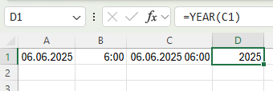

(Note: use MONTH and DAY function to extract month and day)

To add a number of years, months and/or days, use the DATE function.

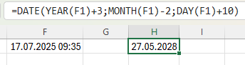

If you only need to add days you can do it like this:

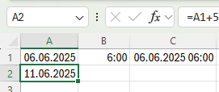

Current date and time

To get the current date and time, use the NOW function.

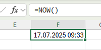

(Note: use the TODAY function to enter today's date in Excel.)
(Note: Result of NOW function will update automatically whenever the sheet is recalculated. )

To extract hour from date use the HOUR function.

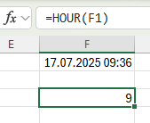

(Note: use the MINUTE function and the SECOND function to return the minute and second.)

To add a number of hours, minutes and/or seconds, use the TIME function.

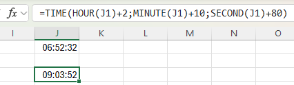

DATEDIF

The DATEDIF function in Excel calculates the number of days, months or years between two dates. The DATEDIF function has 3 arguments.

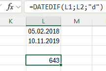

(Note: type "d" for the third argument to get the number of days between two dates, "m" to get the number of months between two dates, "y" to get the number of years between two dates, "yd" to ignore years and get the number of days between two dates, "md" to ignore months and get the number of days between two dates, "ym" to ignore years and get the number of months between two dates.)

You can also use DAYS function to achieve the same result:

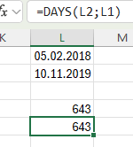

Calculate age 

We can use DATEDIF to calculate the age of a person:

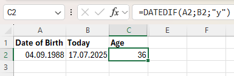

Use this formula to calculate the exact age: 

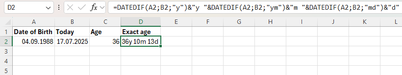

WEEKDAY

The WEEKDAY function in Excel returns a number from 1 (Sunday) to 7 (Saturday) representing the day of the week of a date.

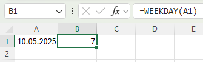

We can use the TEXT function with "dddd" format to display that day

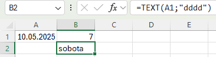

(Note: sobota means Saturday in polish)

NETWORKDAYS

The NETWORKDAYS function in Excel returns the number of workdays between two dates. NETWORKDAYS excludes weekends (Saturday and Sunday).

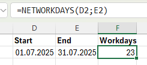

Formula that returns the quarter for a given date:

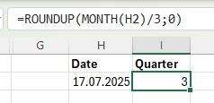

(Note: there's no built-in function in Excel that can do this)
(Note: ROUNDUP(x,0) always rounds x up to the nearest integer)

